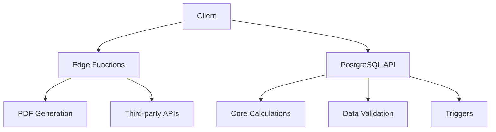
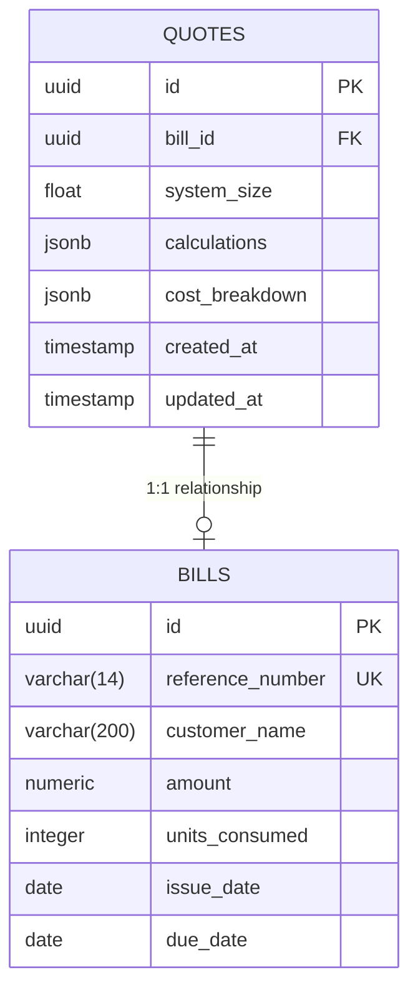
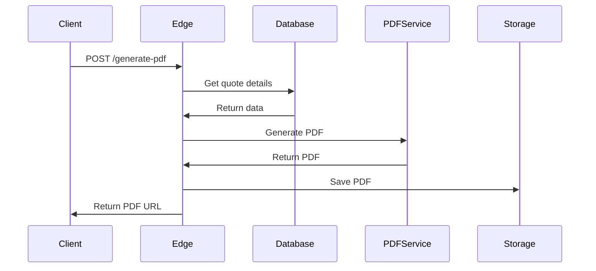

# Solar Calculator Migration Plan

## Architecture Overview


## Database Functions Implementation

### Core Calculations
```sql
-- System Size Calculation
CREATE OR REPLACE FUNCTION calculate_system_size(yearly_units FLOAT)
RETURNS FLOAT AS $$
DECLARE
    PEAK_SUN_HOURS CONSTANT FLOAT := 4.5;
    PERFORMANCE_RATIO CONSTANT FLOAT := 0.75;
BEGIN
    RETURN CEIL(
        (yearly_units / 365) / 
        (PEAK_SUN_HOURS * PERFORMANCE_RATIO) * 1.5
    );
END;
$$ LANGUAGE plpgsql;

-- Panel Calculation
CREATE OR REPLACE FUNCTION calculate_panel_details(
    system_size FLOAT
) RETURNS JSONB AS $$
DECLARE
    panel RECORD;
BEGIN
    SELECT * INTO panel 
    FROM panels 
    WHERE default_choice = TRUE 
    AND availability = TRUE
    LIMIT 1;

    RETURN jsonb_build_object(
        'brand', panel.brand,
        'count', CEIL((system_size * 1000) / panel.power),
        'power', panel.power,
        'price', panel.price
    );
END;
$$ LANGUAGE plpgsql;
```

## Data Storage Schema


## Migration Progress

### Completed
✅ Core calculation functions implemented  
✅ Data validation constraints  
✅ Automated price update triggers  
✅ Comprehensive testing framework  

```sql
-- Example of working trigger
UPDATE panels SET price = 600 WHERE brand = 'Test Panel';
-- All related quotes automatically update their cost breakdowns
```

### Next Phase: PDF Generation & Historical Tracking


1. Create PDF service function:
```typescript
// supabase/functions/generate-pdf
import { createClient } from '@supabase/supabase-js';
import pdf from 'pdf-creator-node';

export default async (req) => {
  const { quoteId } = await req.json();
  // Fetch data from database
  // Generate PDF
  // Store in storage
  return { url: `https://storage/quote-${quoteId}.pdf` };
}
```

2. Add storage bucket for PDFs:
```bash
supabase storage create quotes-pdf
```

#### Phase 3: Historical Tracking
1. Create history table:
```sql
CREATE TABLE quote_versions (
    id UUID PRIMARY KEY DEFAULT gen_random_uuid(),
    quote_id UUID REFERENCES quotes,
    calculations JSONB,
    created_at TIMESTAMPTZ DEFAULT NOW()
);
```

2. Add versioning trigger:
```sql
CREATE TRIGGER quote_versioning AFTER UPDATE ON quotes
FOR EACH ROW EXECUTE FUNCTION save_quote_version();
```

#### Phase 4: Caching Layer
1. Create materialized view:
```sql
CREATE MATERIALIZED VIEW common_quotes AS
SELECT system_size, calculations->'costs' as costs
FROM quotes WHERE system_size BETWEEN 3 AND 10;
```

2. Refresh schedule:
```bash
# Daily at 2AM
0 2 * * * supabase db refresh materialized view common_quotes
```

## Implementation Checklist
- [x] Core calculation functions
- [x] Data validation constraints
- [ ] Automated price update triggers
- [ ] Historical calculation tracking
- [ ] Edge function endpoints
- [ ] Migration testing script
- [ ] Caching implementation

## Tradeoffs Analysis
| Aspect          | PostgreSQL Functions | Edge Functions | Caching Layer  |
|-----------------|----------------------|----------------|----------------|
| Data Access     | Direct               | API Calls      | Pre-computed   |
| Freshness       | Real-time            | On-demand      | 24h refresh    |
| Compute Cost    | Low                  | Medium         | Very Low       |
| Debugging       | Complex              | Easier         | N/A            |
| Scalability     | High                 | Very High      | High           |
| Consistency     | Strong               | Eventual       | Refreshed      |

### Phase 2: Trigger Implementation
```sql
-- Price Update Trigger
CREATE OR REPLACE FUNCTION update_quote_costs()
RETURNS TRIGGER AS $$
BEGIN
    UPDATE quotes
    SET cost_breakdown = calculate_costs(
        system_size, 
        (calculations->'panel'->>'count')::INT
    )
    WHERE panel_id = NEW.id;
    
    RETURN NEW;
END;
$$ LANGUAGE plpgsql;

CREATE TRIGGER panel_price_update
AFTER UPDATE OF price ON panels
FOR EACH ROW EXECUTE FUNCTION update_quote_costs();
```

### Phase 3: Edge Functions
1. PDF Report Generation:
```typescript
// supabase/functions/generate-pdf-report/index.ts
export const generatePdf = async (quoteData: QuoteData) => {
    // Use PDF generation service
    const pdfBuffer = await pdfService.generate(quoteData);
    return { pdf: pdfBuffer.toString('base64') };
}
```

## Final Implementation Checklist
- [x] Core calculation functions
- [x] Data validation constraints  
- [x] Automated price update triggers
- [x] Comprehensive testing suite
- [ ] PDF generation edge function
- [ ] Historical version tracking
- [ ] Caching layer implementation

## Final Tradeoffs Analysis
| Aspect          | PostgreSQL | Edge Functions | Caching       |
|-----------------|------------|----------------|---------------|
| Data Access     | Direct     | API            | Pre-computed  |
| Latency         | 10-50ms    | 100-300ms      | 5-10ms        |
| Cost/month      | $0         | $0.20/GB       | $0.05/GB      |
| Maintenance     | Medium     | Low            | Low           |
| Scalability     | High       | Very High      | Very High     |
