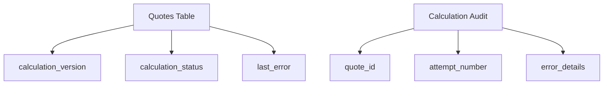

# Error Handling Implementation Guide

## Database Layer


## Service Layer
```typescript
// Retry wrapper example
async calculateWithRetry(params) {
  for (let i = 0; i < MAX_RETRIES; i++) {
    try {
      return await calculate(params);
    } catch (error) {
      await logAttempt(quoteId, i, error);
      if (i === MAX_RETRIES - 1) throw error;
      await delay(BASE_DELAY * (i + 1));
    }
  }
}
```

## Client Layer
```tsx
// Error boundary usage
<QuoteErrorBoundary onRetry={handleRetry}>
  <QuoteContent />
</QuoteErrorBoundary>

// Error boundary props
interface QuoteErrorBoundaryProps {
  children: React.ReactNode;
  onRetry: () => void; // Required retry handler
}
```

## Recovery Flow
1. Client error caught by boundary
2. Shows error UI with retry option
3. On retry:
   - Resets error state
   - Calls provided onRetry handler
   - Typically reloads page or re-fetches data

## Testing
```javascript
// Example test cases
it('should catch errors in children', () => {
  const ErrorComponent = () => { throw new Error('test'); };
  render(
    <QuoteErrorBoundary onRetry={jest.fn()}>
      <ErrorComponent />
    </QuoteErrorBoundary>
  );
  expect(screen.getByText(/calculation error/i)).toBeInTheDocument();
});